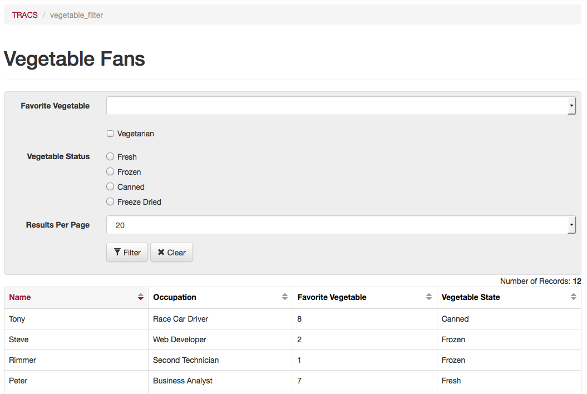

# Using Generator

## Revision History

| Version | Date          | Author     | Description       |
|---------|---------------|------------|-------------------|
| 0.1     | Mar. 11, 2015 | Steve King | Document Created. |
|         |               |            |                   |
|         |               |            |                   |

## Introduction

This is a tutorial on using the generator scripts to generate a user interface
for a database table. Generator will generate most of the files needed for a 
new module in codeIgniter. These files include the controller, the model, the
views, and the javascript file. The generated modules also depend on project 
wide assets, including css files, jQuery, and the bootstrap library. The 
advantage of using these scripts in generating a new module is that much of the
generic functionality that we want to reproduce in similar interfaces is 
already worked out in the generated files. We can then focus more closely on 
implementing the specific business requirements of each new module. Having a 
boilerplate generated also gives the added benefit that coding style and 
user interface functions become more consistent and predictable.

This tutorial steps through three examples of how the generater scripts are used. Once it is understood how these scripts are used, and how to read them, you will be able to generate the same style of user interface for any database tables. To generate a new user interface, we can simply duplicate one of the testing scripts and change the necessary options for our specific database table.

### Directory structure

From the root of the Generator repository, we will be working with the 'Modules/Tracs/scripts' folder. This folder contains the testing scripts used in this tutorial. This folder should also be the location of new scripts you write to generate new interfaces in TRACS. 

### Setup

To do the tutorial, we will need to setup some database tables in your virtual machines MySQL database. Access phpMyAdmin on your virtual machine. It should be located at the url: pma.busdevw. Now choose the Import menu in phpMyAdmin. There is a file called vegetable.sql. Import this sql file. After importing you should have two new database tables: vegetable and vegetable_fans. Go ahead and take a look at these tables to familiarize yourself. The vegetable table is a lookup table that the vegetable_fans table uses.

## Look-up tables

There are two testing scripts that generate interfaces for managing lookup tables in TRACS. The lookup table interface is located at '/tracs/admin/lut'. Each of the two generators for lookup table interfaces creates a master-detail view. The master view shows a table with all of the data, and it may be truncated. The master view also has filters to search for specific data in the tabels. On each column of the master view, there is an edit button. When the edit button is clicked, it will take you to a detailed view for the entry in the row that was clicked. 

The script ordering_test_lut.php generates a lookup table interface that allows re-ordering of the entries with up and downs arrows on each row. The script sorting_test_lut.php creates an interfaces where the columns of the master table view can be sorted in ascending or descending order.

TO-DO: Finish tutorial on the look-up tables

## Filter Table

There is a testing script that generates a simple one-page interfaces that
includes a filter form and a master table view. Each row of the filter table interface can be sorted in ascending or descending order. The file 'filter_table_test.php' will generate a testing interfaces located at '/tracs/admin/vegetable_filter'. 

### Running the Script

Login to the virtual machine. Go to the directory that contains the script and run it:

    $ cd /vagrant/generator/Modules/Tracs/scripts
    $ php -f filter_table_test.php
    Created 8 files:
    /vagrant/sites/beedie-ssl/tracs/application/views/admin/vegetable_filter/vegetable_filter_table_view.php
    /vagrant/sites/beedie-ssl/tracs/application/views/admin/vegetable_filter/vegetable_filter_panel_footer_view.php
    /vagrant/sites/beedie-ssl/tracs/application/views/admin/vegetable_filter/vegetable_filter_panel_header_view.php
    /vagrant/sites/beedie-ssl/tracs/application/views/admin/vegetable_filter/vegetable_filter_filter_panel_view.php
    /vagrant/sites/beedie-ssl/tracs/application/controllers/admin/vegetable_filter.php
    /vagrant/sites/beedie-ssl/tracs/application/views/admin/vegetable_filter/vegetable_filter_view.php
    /vagrant/sites/beedie-ssl/tracs/application/models/vegetable_filter_model.php
    /vagrant/sites/beedie-ssl/tracs/assets/js/vegetable_filter/vegetable_filter_table.js

Now, navigate to the address '/tracs/admin/vegetable_filter'. You should see a new filter table interface that looks like the following image:

### Explanation of the Script

In this section we will step through the script file 'filter_table_test.php', and explain how it works. After understanding how this test script works, you should be able to use this script as a template for new scripts to generator interfaces for other database tables.

The first few lines include the necessary Generator driver class. It is also a good idea to use header comments for describing the purpose and reason for the interface. The next few lines set some variable names that define the name of the new interface, as well as the database table name that this interface is for. 

In the section "Main List View data" we are defining the database column names, and the attributes for these columns. These column names are translated as table columns in the interface. In this case, there is four columns: name, occupation, vegetable_id, and vegetable_status. We use the TableColumn class to instantiate new columns. The first parameter of the constructor is the database column name, and the second parameter is an option array of html parameters. In this script, we are passing in class parameter so that we can use bootstraps grid layout feature to size our table columns. We also define the display name for each column if we want it to differ from the database column name.

After creating all of our table columns, we create a table by instantiating a new instance of TableModel class. The first parameter for the constructor for TableModel takes a name, which is used in the naming of the filename. The second parameter for the TableModel constructor takes a table name. In our script we are passing in the name 'vegetable_fans'. The third parameter of the TableModel constructor takes an array of TableColumn objects. The fourth parameter of TableModel constructor takes a value for the primary key column of the table we passed in the second paramter. In this case, the primary key for the vegetable_fans table is called 'id'. The fifth parameter of the TableModel constructor takes an array of optional html parameters. In this script we pass in values to set the id and class of the table element.

In the section called 'Filter form Data', we set all the data to generate the filter form. The filter form is above the filter table, and is contained in a grey rounded panel. The process of configuring a form to be generated is similar to that for the table we did above. The first step is to instantiate all the FormFieldModel objects we need to represent form fields. The second step is to instantiate a FormModel, passing in our FormFieldModel objects as well as other configuration data to generate the filter form.

All FormFieldModel objects we use are extended from the base FormFieldModel abstract class. In this example, we create form fields for a dropdown, a checkbox, and a radio input. 

The DropdownFormFieldModel uses the vegetable lookup table for populating it's options. The first parameter we pass to DropdownFormFieldModel is the foreign key column name in the vegetable_fans table. The second parameter to the constructor is the type of form element, 'dropdown'. The third parameter is an array of options we use for setting the id and class of the select input element. After instantiating the DropdownFormFieldModel object, we use the set_table_col instance method to configure this form element to use a lookup table. The first parameter of the set_table_col instance method is the lookup table's name. The second parameter of the set_table_col instance method is the primary key column name in the lookup table. The third parameter of the set_table_col instance method is the column in the lookup table we want to use for the display in the html dropdown. The column 'name' in the vegetable lookup table has all the vegetable names, which is what we want users to see when they use the form dropdown. Finally, we use the set_label_name instance method, which is common to all FormFieldModel sub-classes, to set the label text that users will see.

The CheckboxFormFieldModel uses a boolean-like datatype, where 1 is true, and 0 is false. This form element represents the column called 'vegetarian' in the vegetable_fans table. The vegetarian column has a tinyint datatype. The set_checked_value and set_default_value instance methods of the CheckboxFormFieldModel class are flexible, since we might want to use enums instead of a tinyint for a boolean value. For example, 'Yes' or 'No'.

The RadioFormFieldModel...